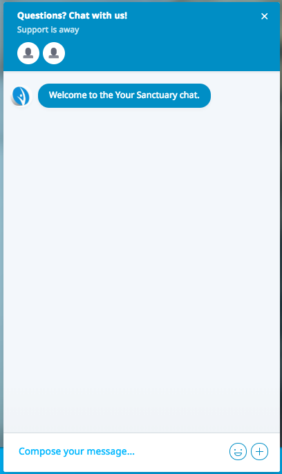
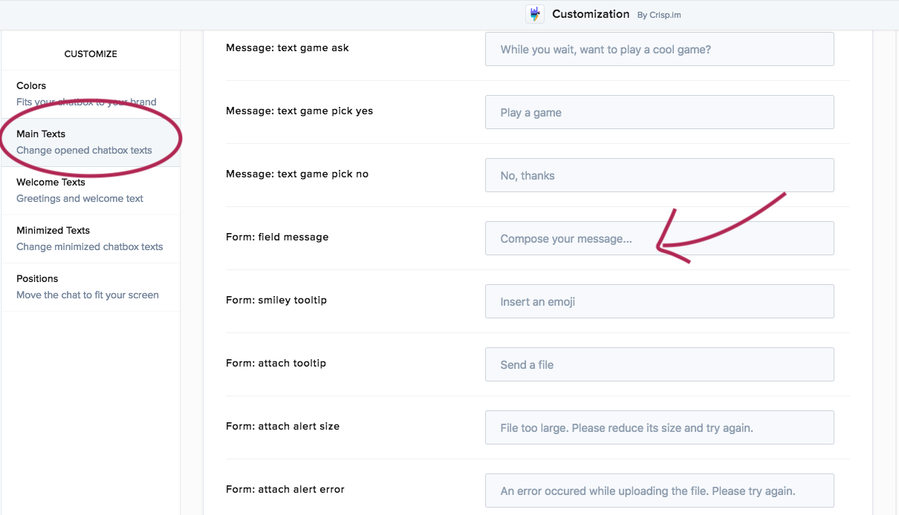

# Instructions for working with Crisp chat

This project uses [Crisp chat](https://crisp.chat/en) to provide both the chatbot and the live chat tool.

There are a few things that will be helpful to know for maintenance:

## Website hours

You aren't yet able to choose a timezone in Crisp, you have to set your hours with reference to UTC time. This means you will have to change the time manually when the clocks go forwards/back. You can do this by going [here](https://app.crisp.chat/settings/availability/) when you are logged in.

## Availability settings

In [these settings](https://app.crisp.chat/settings/availability/) there is an option 'Set me available when using the app'. We recommend keeping this turned off, as otherwise when you are making changes on the app you will appear in the chatbox as online, which could confuse the user because on the website it states the opening hours very clearly.

This is also where you can edit your availability schedule. At the moment this tool is not very advanced and you can't set different hours for different days. They are working on improving this feature though, so watch this space.

If you do edit your availability schedule on Crisp, remember it will also have to be updated on the chat.yoursanctuary.org.uk site.

## Operators

Go [here](https://app.crisp.chat/settings/websites/) and select 'Settings' for Your Sanctuary, then select 'Operators in the team'. Here you can add more operators as required. If you make them an owner, they will be able to edit everything about the app. As a member, their access will be more limited.

## Message Shortcuts

[Here](https://app.crisp.chat/settings/shortcuts/) you can create shortcuts for messages that you find yourself writing frequently. I've created one for you already which is used by writing '!busy' in a conversation. This changes into "Unfortunately all of our advisors are currently busy. We'll be with you as soon as possible though!". You can make more shortcuts to enable to you reply to users quickly.

## Editing the chatbot

You can access the chatbot by going to 'Plugins' in the left hand navigation menu and then scrolling down to 'Bot'. You will then see the different active scenarios. If you wish to edit the content of any of these, you can do so.

Here is an example of editing the content of the refuge flow to fix a typo:

Tips when editing the chatbot:

- be careful not to click 'Delete' (particularly 'Block and Children') unless you definitely want to, because it's quite slow work to build everything back again and I haven't found an undo feature!
- when you've made a change, you have to make sure you click 'Save' and then 'Deploy' before it is live
- it's quite fiddly to get to the bot via the dashboard every time so you may want to add a bookmark
- most of the 'test bots' displayed on the right side of the page when editing a flow won't work becuase most of the flows aren't triggered by a message, but by the end of another flow

## Customization

In the list of plugins, there is also one called 'Customization'. In here, you can change the texts that are displayed on the chat box, for example 'Questions? Chat with us!' or 'Compose your message...' in the below picture:

